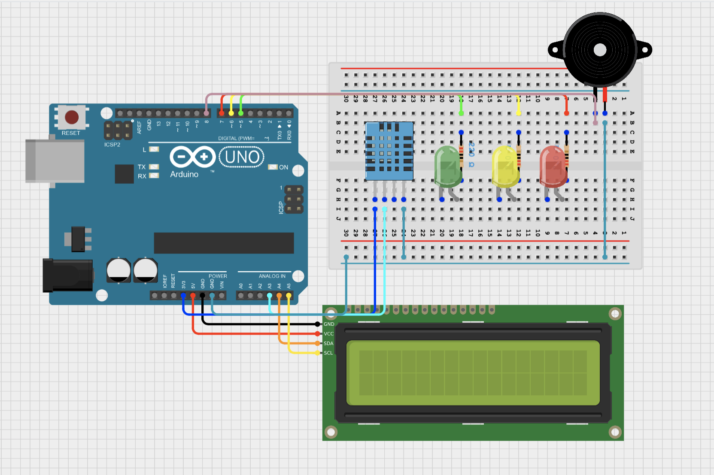

# Arduino-Temperature-Humidity-Monitor
This project is an Arduino-based Temperature and Humidity Monitoring System using a DHT11 sensor. The readings are shown on an LCD, with LEDs and a buzzer used to indicate different temperature levels.

## Objective
The main objective is to monitor environmental conditions and quickly detect when the temperature exceeds a safe range.

## How it works
The DHT11 sensor measures the temperature and humidity and sends the data to the Arduino Uno.

The Arduino analyzes the temperature and controls the LEDs and buzzer according to the following levels:

• 🟢 0–30°C: Normal temperature → Green LED ON

• 🟡 Above 30°C to 40°C: Moderate temperature → Yellow LED ON

• 🔴 Above 40°C: High temperature → Red LED ON + Buzzer ON

The current temperature and humidity are continuously displayed on the LCD screen.

##  Possible Applications

Similar temperature monitoring and alarm systems can be used in:

• Factories and industrial facilities

• Server rooms and data centers

• Laboratories

• Greenhouses

• Electrical and electronic equipment rooms

• Weather monitoring stations

## Components

• Arduino Uno

• DHT11/DHT22 Temperature and Humidity Sensor 

• 16×2 I2C LCD Display

• LEDS ( green, yellow, red )

• Piezo Speaker / Buzzer

• 220Ω Resistors

• Breadboard

• Jumper Wires

## Circuit Simulation



## Real Circuit


## Arduino Code

```cpp
{}[lcdtemperature.ino](lcdtemperature.ino){}
